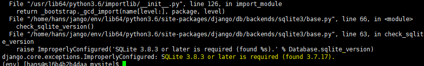

# SQLite 3.8.3 or later is required (found 3.7.17).

db migrate를 할때 다음과 같은 에러가 발생한다.

구글링 해봤는데 답을 알지 못했다.

어떤 분이 장고 하위 버전을 설치하면 넘어간다해서 2.1.2 버전을 깔았더니 에러는 없어졌다. 그 전 버전은 uninstall한다.

`$ pip install django==2.1.2`

<https://stackoverflow.com/questions/56520658/djangoshowing-improperlyconfigured-error-sqlite-3-8-3-or-later-is-required-f>