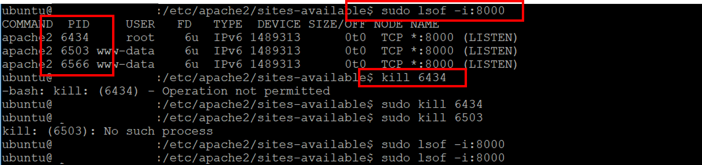

# That port is already in use.

### In Django

해당 포트를 사용하고 있는 프로세스를 죽이자!

먼저 어떤 프로세스가 해당 포트를 사용하고 있는지 찾아야 한다.

> sudo lsof -i : 해당port

프로세스 ID( == PID) `6434`를 kill 해준다!

> kill 6434

나머지 PID ( 6503, 6566 )은 kill 하지 않았는데 없어졌다. `6434`가 root라서 그런가?

이제 다시 django를 run하면 8000 포트를 사용하여 실행 시킬 수 있다.