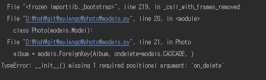

# __init__() missing 1 required positional argument: 'on_delete'



장고 2.0? 버전 부터 model 작성시 `ForeignKey`를 사용할때는 `on_delete`요소를 넣어줘야 한다고 한다.


```python
album = models.ForeignKey(Album, on_delete=models.CASCADE, )
```


### CASCADE

원래 db에서 다른 테이블에 PK를 FK로 가져왔을 때 PK값을 지우고 싶은 경우 다른 테이블의 FK값의 레코드가 먼저 삭제돼야 한다. 이때 `CASCADE`를 써서 PK값이 삭제되면 FK의 레코드도 같이 삭제하는 걸 명시하는 것이다.