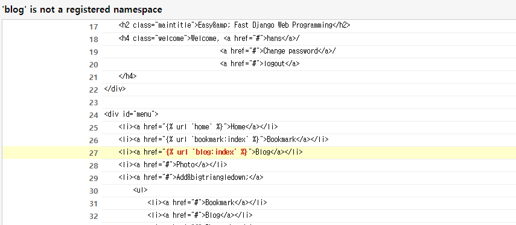
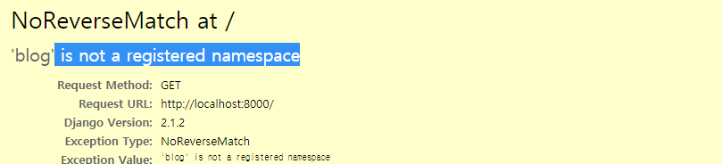

#  "something" is not a registered namespace

html에서 다음과 같이 url을 요청할 때, `is not a registered namespace` 에러가 뜬다.






### 확인해 봐야 할 것들.

- `settings.py` 파일에  `INSTALLED_APPS`에  해당 어플리케이션의 name이 들어간 class가 등록됐는가

  ```python
  INSTALLED_APPS = [
      ...
      'bookmark.apps.BookmarkConfig',
      'blog.apps.BlogConfig'
  ]
  ```

- `urls.py`파일에서 해당 url에 name을 잘 매핑했는가

  ```python
  urlpatterns = [
      path('admin/', admin.site.urls, name='admin'),
      path('bookmark/', include('bookmark.urls'), name='bookmark'),
      path('blog/', include('blog.urls'), name='blog'),
      path('', HomeView.as_view(), name='home')
  ]
  ```


나의 경우는 이 두가지 모두 했는데 에러가 났다. 아래처럼 수정하니 잘 동작했다.

- 해당 어플리케이션의 `urls.py`파일에서 `app_name`을 명시한다.

  ```python
  app_name = "blog"
  
  urlpatterns = [
      # /
      path('', PostLV.as_view(), name='index'),
      # /post/
      path('post/', PostLV.as_view(), name='post_list'),
      # /post/django-example/
      ...
  ]
  ```

  