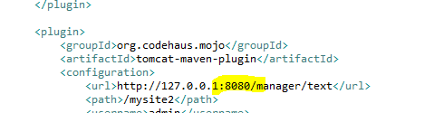

# Cannot invoke Tomcat manager: Connection refused (Connection refused)

나의 경우는 `pom.xml`에서 포트를 서버에서 톰캣을 돌리는 포트와 맞게 해주지 않아서 발생했다.

`pom.xml`에서의 포트와 해당 프로그램이 돌아갈 톰캣의 포트를 일치 시키자.

이밖에도 해당에러는 pom.xml에서 잘못된 설정으로 인해 생기는것 같다.