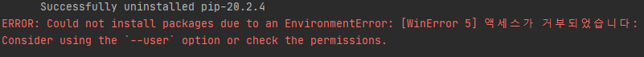
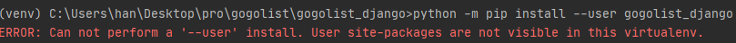

# Consider using the --user option or check the permissions.

pip install` 명령어를 실행하려고 하니 `--user`옵션을 줘라고 한다.

옵션을 줬더니 실행할 수 없다고 한다.

이때 해당 venv 하위에 있는 `pyvenv.cfg` 파일에서 `include-system-site-packages` 값을 `true`로 변경해주자!

https://github.com/microsoft/vscode-python/issues/14327

