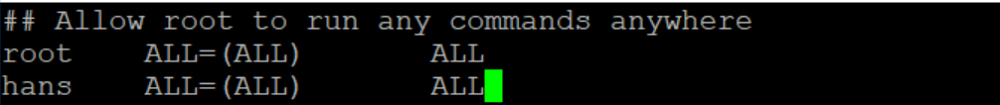

# user is not in the sudoers file

user 계정에서 `sudo`로 권한을 얻고자 했으나 해당 에러가 발생한다.

`/etc/sudoers`에 user 계정을 등록해서 권한을 가질수 있도록 해주자~

1. 먼저 `/etc/sudoers`파일을 수정할 수 있도록 권한을 줘야 한다.

   `chmod 777 /etc/sudoers`

2. 권한을 주고싶은 계정을 추가해주자.

   파일 하위에 `root	ALL=~`부분에 계정을 추가해 주면된다.

   

3. 다시 `/etc/sudoers`파일의 권한을 readonly로 돌려놓자

   `chmod 440 /etc/sudoers`