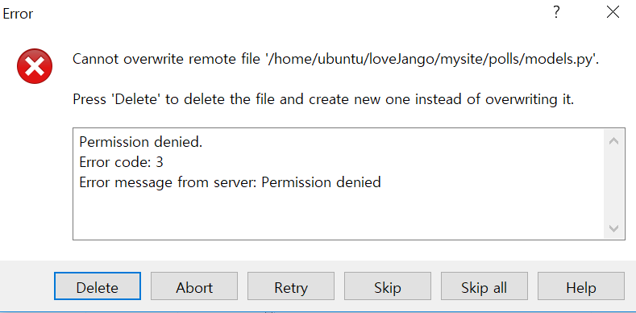
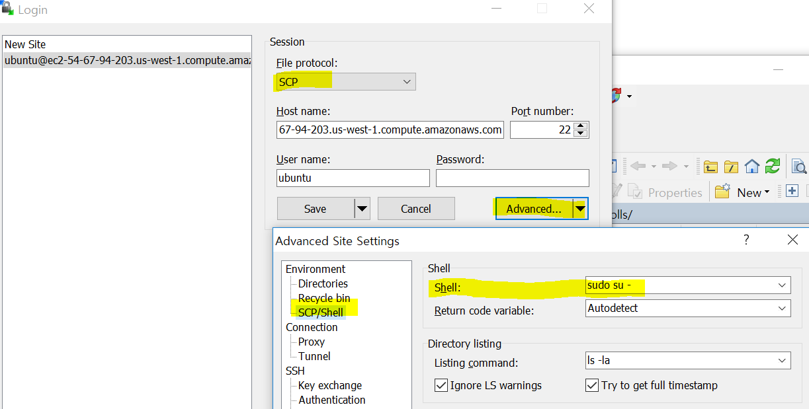

# Winscp permission denied

winscp에서 파일을 보낼때 `permission denied` 에러가 발생한다.

권한을 부여하자!

1. File protocol을 `SCP`로 설정한다.
2. Advanced -> SCP/Shell에서 Shell 칸에 `sudo su - `를 입력해서 root권한으로 수행하게 한다.

### SCP (Secure Copy)

`todo`